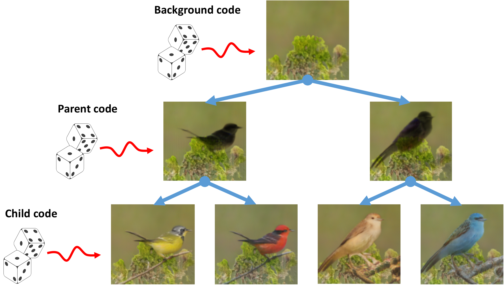
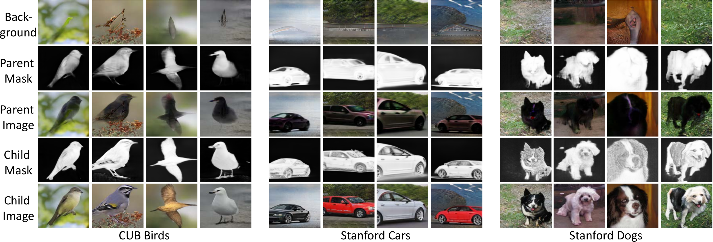
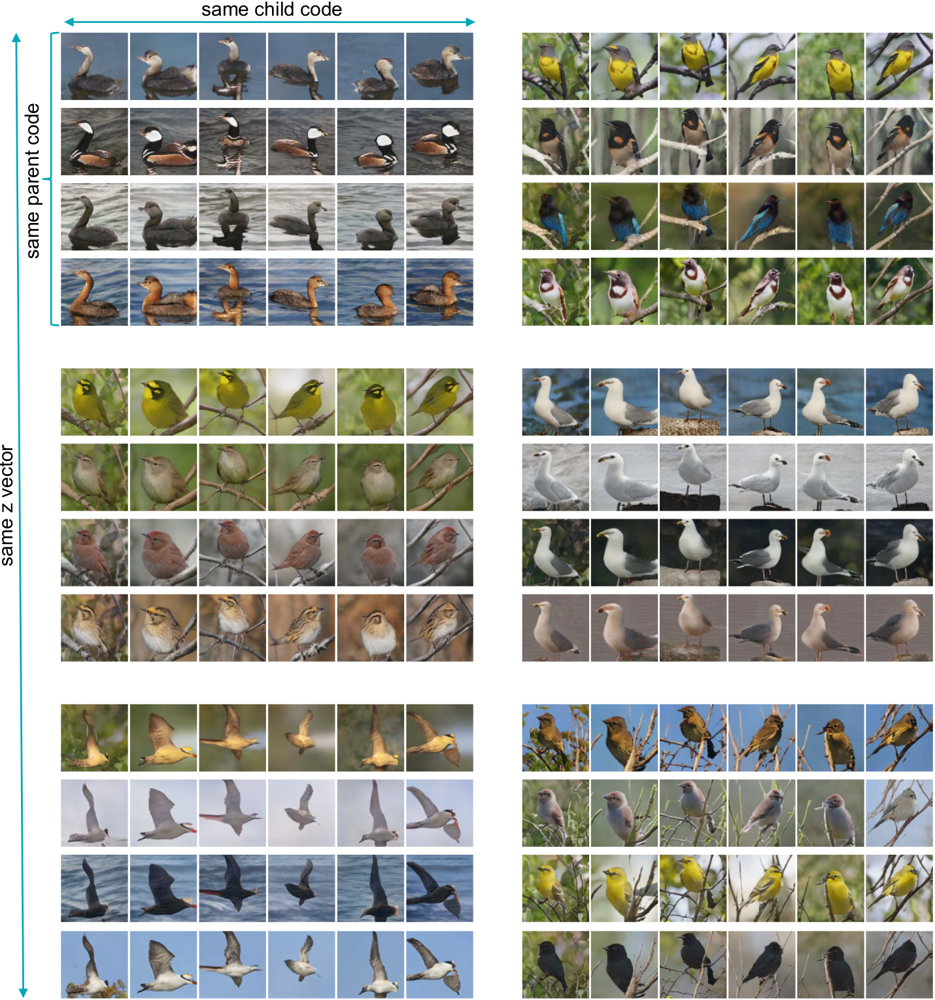

# FineGAN
Pytorch implementation for learning to synthesize images in a hierarchical, stagewise manner by disentangling background, object shape and object appearance.
<br/>
<br/>

<br/>
<br/>


### FineGAN: Unsupervised Hierarchical Disentanglement for Fine-grained Object Generation and Discovery
[Krishna Kumar Singh*](http://krsingh.cs.ucdavis.edu), [Utkarsh Ojha*](https://utkarshojha.github.io/), [Yong Jae Lee](http://web.cs.ucdavis.edu/~yjlee/)
<br/>
[project](http://krsingh.cs.ucdavis.edu/krishna_files/papers/finegan/index.html) |
 [arxiv](https://arxiv.org/abs/1811.11155) | [demo video](https://www.youtube.com/watch?v=tkk0SeWGu-8)
<br/>
**[CVPR 2019 (Oral Presentation)](http://cvpr2019.thecvf.com/)**
## Architecture
<br/>


## Requirements
- Linux
- Python 2.7
- Pytorch 0.4.1
- TensorboardX 1.2
- NVIDIA GPU + CUDA CuDNN

## Getting started
### Clone the repository
```bash
git clone https://github.com/kkanshul/finegan
cd finegan
```
### Setting up the data
**Note**: You only need to download the data if you wish to train your own model.

Download the formatted CUB data from this [link](https://drive.google.com/file/d/1ardy8L7Cb-Vn1ynQigaXpX_JHl0dhh2M/view?usp=sharing) and extract it inside the `data` directory
```bash
cd data
unzip birds.zip
cd ..
```
### Downloading pretrained models

Pretrained generator models for CUB, Stanford Dogs are available at this [link](https://drive.google.com/file/d/1cKJAXRDQ-_a76bHWRqcIdmPXqpN8a1lR/view?usp=sharing). Download and extract them in the `models` directory.
```bash
cd models
unzip netG.zip
cd ../code/
```
## Evaluating the model
In `cfg/eval.yml`:
- Specify the model path in `TRAIN.NET_G`.
- Specify the output directory to save the generated images in `SAVE_DIR`. 
- Specify the number of super and fine-grained categories in `SUPER_CATEGORIES` and `FINE_GRAINED_CATEGORIES` according to our [paper](https://arxiv.org/abs/1811.11155). 
- Specify the option for using 'tied' latent codes in `TIED_CODES`:
  - if `True`, specify the child code in `TEST_CHILD_CLASS`. The background and parent codes are derived through the child code in this case.
  - if `False`, i.e. no relationship between parent, child or background code, specify each of them in `TEST_PARENT_CLASS`, `TEST_CHILD_CLASS` and `TEST_BACKGROUND_CLASS` respectively.  
- Run `python main.py --cfg cfg/eval.yml --gpu 0`

## Training your own model
In `cfg/train.yml`:
- Specify the dataset location in `DATA_DIR`.
  - **NOTE**: If you wish to train this on your own (different) dataset, please make sure it is formatted in a way similar to the CUB dataset that we've provided.
- Specify the number of super and fine-grained categories that you wish for FineGAN to discover, in `SUPER_CATEGORIES` and `FINE_GRAINED_CATEGORIES`.
- Specify the training hyperparameters in `TRAIN`.
- Run `python main.py --cfg cfg/train.yml --gpu 0`

## Sample generation results of FineGAN
### 1. Stage wise image generation results


### 2. Grouping among the generated images (child). 



## Citation
If you find this code useful in your research, consider citing our work:
```
@inproceedings{singh-cvpr2019,
  title = {FineGAN: Unsupervised Hierarchical Disentanglement for Fine-Grained Object Generation and Discovery},
  author = {Krishna Kumar Singh and Utkarsh Ojha and Yong Jae Lee},
  booktitle = {CVPR},
  year = {2019}
}
```
## Acknowledgement
We thank the authors of [StackGAN++: Realistic Image Synthesis with Stacked Generative Adversarial Networks](https://arxiv.org/abs/1710.10916) for releasing their source code.
## Contact 
For any questions regarding our paper or code, contact [Krishna Kumar Singh](mailto:krsingh@ucdavis.edu) and [Utkarsh Ojha](uojha@ucdavis.edu).
